# QuiteReads Dashboard - Architecture Canvas

> **A visual mental model connecting all architectural components**

## 🎯 System Overview

QuiteReads Dashboard implements a federated learning book recommender system comparing centralized vs federated matrix factorization approaches.

**Tech Stack**: Python 3.12 | FastAPI | SQLAlchemy (async) | PostgreSQL | PyTorch Lightning | Flower Framework

---

## 🏗️ Clean Architecture Layers

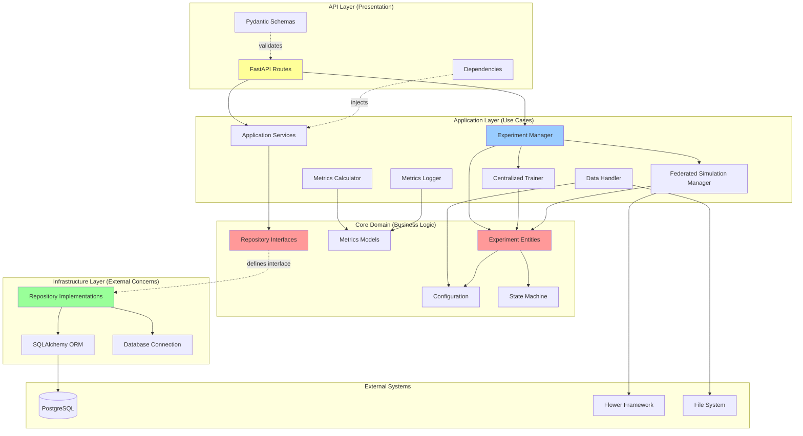

**Dependency Rule**: Inner layers (Core) know nothing about outer layers (Infrastructure, API). Dependencies point INWARD.

---

## 🔄 Complete Data Flow

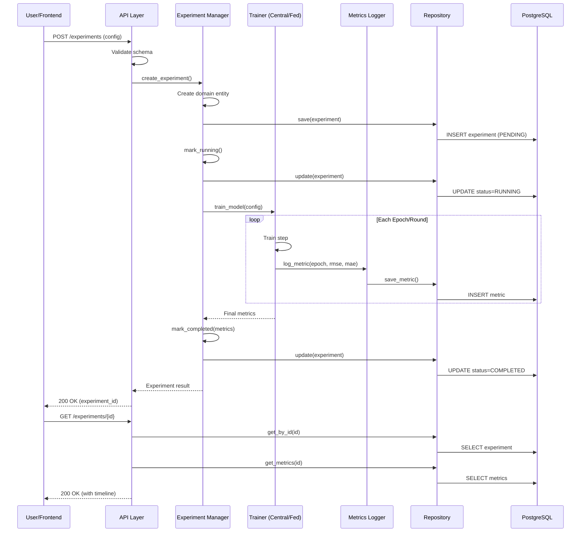

---

## 📦 Directory Structure & Responsibilities

```
quitereads-dashboard/
│
├── app/
│   ├── core/                          # 🔴 DOMAIN LAYER (Business Rules)
│   │   ├── experiments.py             # Experiment entities + state machine
│   │   ├── entities.py                # Dataset, Rating, LocalUserData
│   │   ├── configuration.py           # Hyperparameter models
│   │   ├── metrics.py                 # Domain metrics models
│   │   ├── repositories/
│   │   │   └── interfaces.py          # Repository contracts (abstractions)
│   │   └── models/
│   │       └── recommender.py         # Matrix factorization interface
│   │
│   ├── application/                   # 🔵 APPLICATION LAYER (Use Cases)
│   │   ├── experiment_manager.py      # Main orchestrator
│   │   ├── training/
│   │   │   ├── centralized_trainer.py # Surprise-based training
│   │   │   └── federated_simulation_manager.py  # Flower simulation
│   │   ├── data/
│   │   │   └── data_handler.py        # Dataset loading/preprocessing
│   │   ├── reporting/
│   │   │   ├── metrics_calculator.py  # RMSE/MAE computation
│   │   │   └── metrics_logger.py      # Per-epoch logging
│   │   └── services/                  # Application services
│   │
│   ├── infrastructure/                # 🟢 INFRASTRUCTURE LAYER (Adapters)
│   │   ├── database.py                # SQLAlchemy engine + session factory
│   │   ├── models.py                  # ORM models (DB tables)
│   │   └── repositories/
│   │       ├── base_repository.py     # Generic CRUD operations
│   │       ├── experiment_repository.py
│   │       └── metrics_repository.py
│   │
│   ├── api/                           # 🟡 API LAYER (Presentation)
│   │   ├── main.py                    # FastAPI app + middleware
│   │   ├── routes/
│   │   │   ├── experiments.py         # Experiment CRUD endpoints
│   │   │   ├── metrics.py             # Metrics retrieval
│   │   │   └── health.py              # Health check
│   │   ├── schemas/                   # Pydantic request/response models
│   │   └── dependencies.py            # Dependency injection
│   │
│   ├── federated/                     # Flower FL implementation
│   │   ├── partitioner.py             # IID user-based partitioning
│   │   ├── strategy.py                # FedAvgItemsOnly (aggregate items only)
│   │   ├── client_app.py              # Flower client
│   │   └── server_app.py              # Flower server
│   │
│   └── utils/                         # Cross-cutting concerns
│       ├── exceptions.py              # Custom exceptions
│       └── logging.py                 # Logging configuration
│
├── src/                               # 🧠 ML PIPELINE (PyTorch Lightning)
│   ├── data/                          # Dataset modules
│   ├── models/                        # Matrix factorization models
│   └── training/                      # Lightning trainers
│
├── tests/
│   ├── unit/                          # Domain + application tests
│   └── integration/                   # API + repository tests
│
├── alembic/                           # Database migrations
├── scripts/                           # Utility scripts
├── data/                              # Raw datasets (gitignored)
├── storage/                           # Model artifacts (gitignored)
└── logs/                              # Application logs (gitignored)
```

---

## 🎭 Experiment State Machine

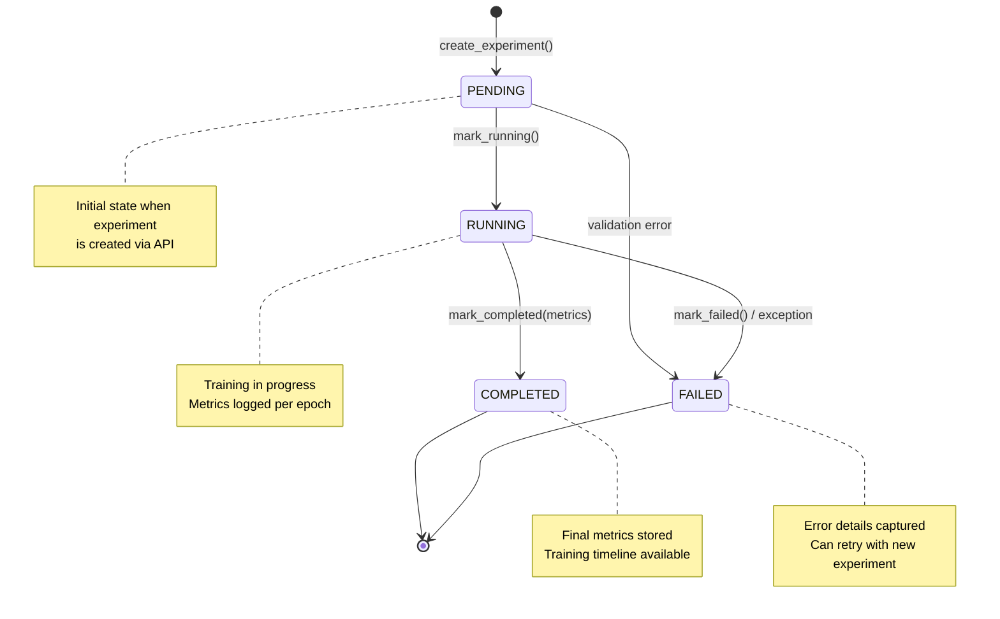

**State Transitions Enforced in Domain Layer** (`app/core/experiments.py`)

---

## 🗄️ Database Schema

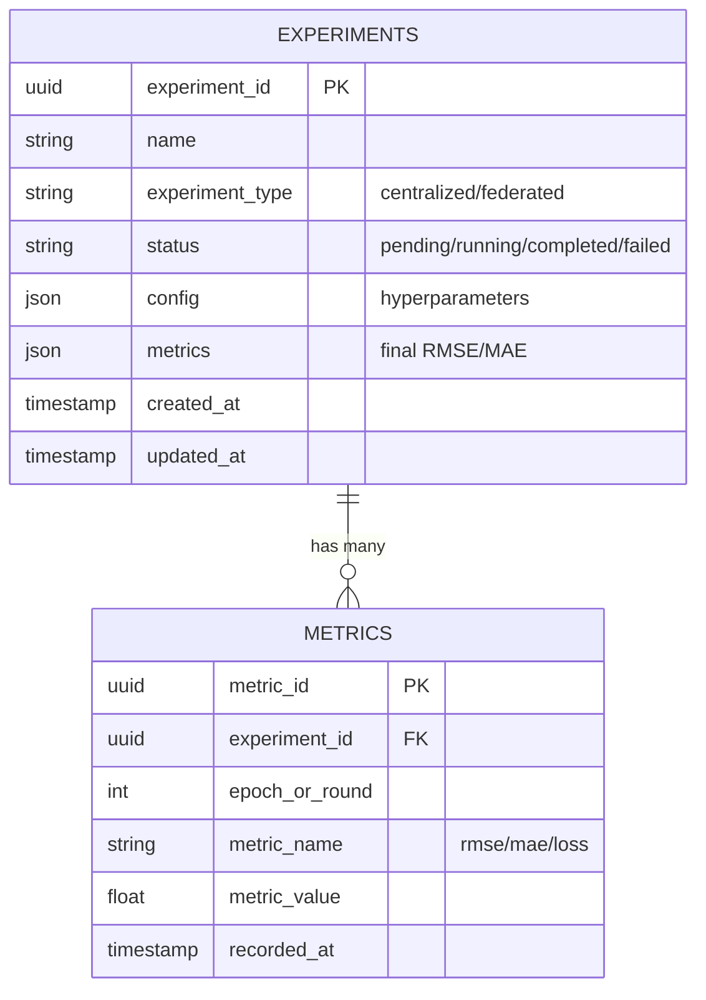

**Migrations**: Managed by Alembic (`alembic/versions/`)

---

## 🛣️ API Endpoints Map

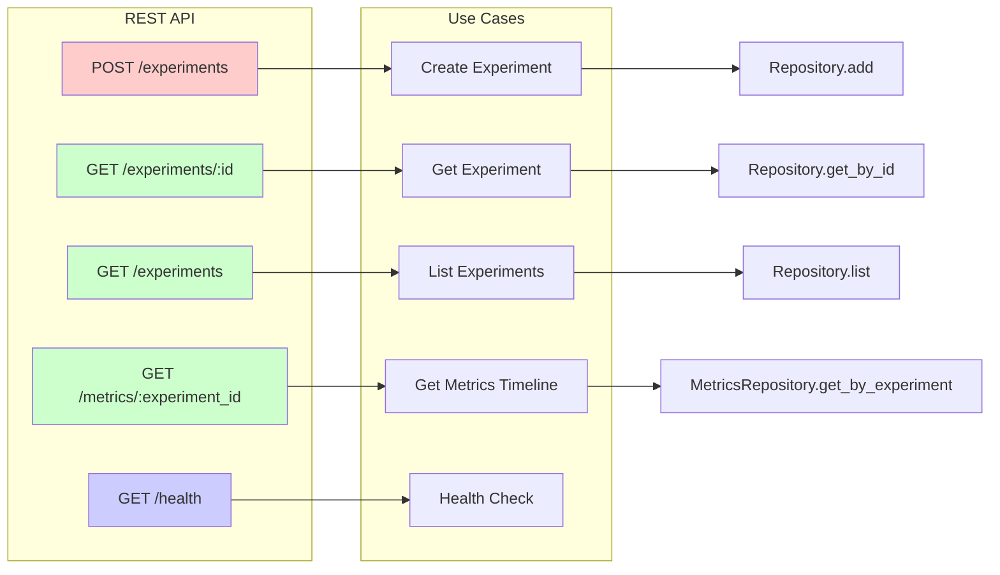

---

## 🔧 Repository Pattern Implementation

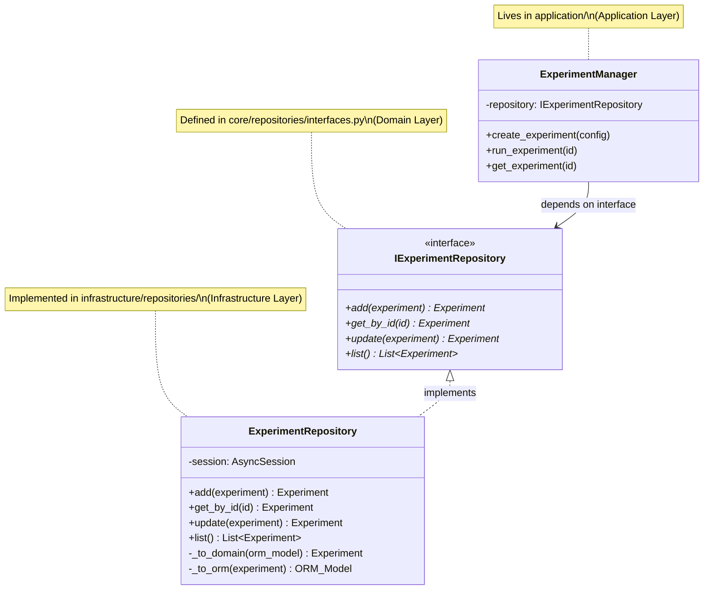

**Key Insight**: Application layer depends on interface (abstraction), not concrete implementation. Infrastructure can be swapped without touching business logic.

---

## 🤝 Federated Learning Architecture

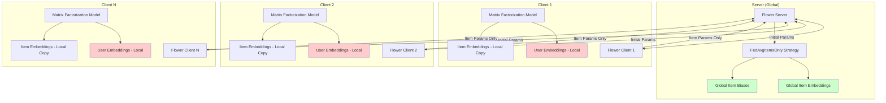

**Privacy-Preserving Approach**:
- ✅ **Item embeddings & biases**: Aggregated globally (FedAvg)
- 🔒 **User embeddings**: Stay local on each client (never shared)

**Implementation**: `app/federated/strategy.py` - Custom `FedAvgItemsOnly` strategy

---

## 🧪 Testing Architecture

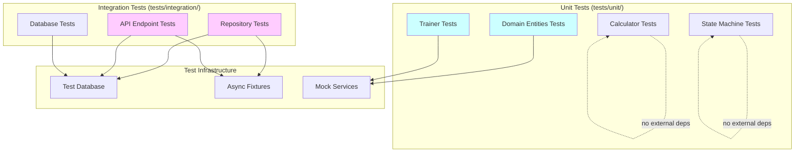

**Test Strategy**:
- **Unit**: Isolated, fast, no I/O (domain logic, calculators)
- **Integration**: Real database, async operations (repositories, API)

---

## 🔄 Async All The Way

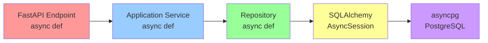

**Async Pattern**: All I/O operations use `async/await` for non-blocking concurrency

---

## 🎓 Key Architectural Patterns

### 1. **Repository Pattern**
- Abstracts data access
- Domain defines interface → Infrastructure implements
- Enables testing with mocks
- **Files**: `core/repositories/interfaces.py` + `infrastructure/repositories/*`

### 2. **Dependency Inversion**
- High-level modules don't depend on low-level modules
- Both depend on abstractions (interfaces)
- **Example**: `ExperimentManager` depends on `IExperimentRepository` (interface), not concrete `ExperimentRepository`

### 3. **Domain-Driven State Machine**
- Business rules enforced in domain entities
- State transitions validated (`PENDING → RUNNING → COMPLETED`)
- **File**: `core/experiments.py`

### 4. **Service Layer Pattern**
- Application services orchestrate domain objects
- Keep controllers thin (API routes just delegate)
- **Files**: `application/experiment_manager.py`, `application/services/*`

### 5. **Strategy Pattern (Federated Learning)**
- Different aggregation strategies (FedAvg, FedProx, etc.)
- Pluggable via Flower framework
- **File**: `federated/strategy.py`

---

## 🚀 Request-to-Response Journey

### Example: Creating a Centralized Experiment

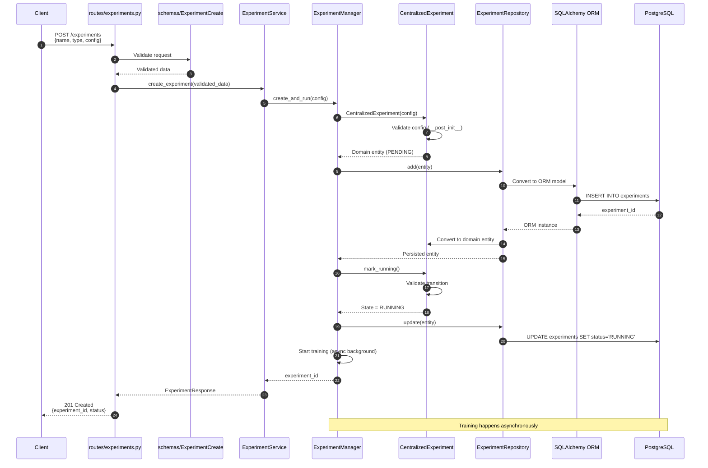

---

## 📊 Configuration Flow

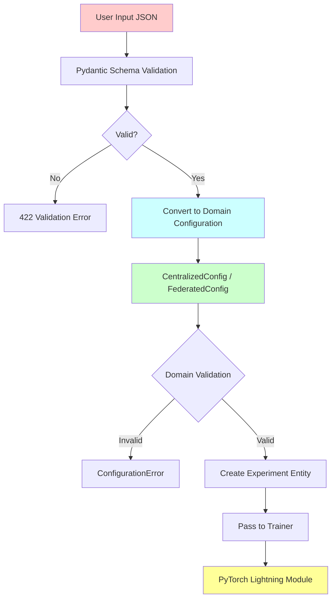

**Two-Layer Validation**:
1. **API Layer**: Pydantic schema validation (types, required fields)
2. **Domain Layer**: Business rule validation (learning_rate > 0, n_factors > 0)

---

## 🔍 Mental Model Checklist

Use this checklist to navigate the codebase:

### "Where do I find...?"

| **What** | **Where** | **Layer** |
|----------|-----------|-----------|
| Business rules & validations | `app/core/experiments.py` | Domain |
| Repository contracts | `app/core/repositories/interfaces.py` | Domain |
| Use case orchestration | `app/application/experiment_manager.py` | Application |
| Training logic | `app/application/training/` | Application |
| Database models (ORM) | `app/infrastructure/models.py` | Infrastructure |
| Repository implementations | `app/infrastructure/repositories/` | Infrastructure |
| API endpoints | `app/api/routes/` | API |
| Request/response schemas | `app/api/schemas/` | API |
| Federated learning setup | `app/federated/` | Application/Infrastructure |
| Matrix factorization models | `src/models/` | ML Pipeline |

### "How do I...?"

| **Task** | **Steps** |
|----------|-----------|
| Add new endpoint | 1. Define route in `api/routes/` <br/> 2. Create Pydantic schemas <br/> 3. Wire to service in dependencies |
| Add new experiment type | 1. Create entity in `core/experiments.py` <br/> 2. Add config in `core/configuration.py` <br/> 3. Implement trainer in `application/training/` |
| Change database schema | 1. Modify ORM models in `infrastructure/models.py` <br/> 2. Run `alembic revision --autogenerate` <br/> 3. Review migration, apply with `alembic upgrade head` |
| Add business validation | Modify domain entity's `__post_init__` in `core/` |
| Add new metric | 1. Add to `core/metrics.py` <br/> 2. Update calculator in `application/reporting/` <br/> 3. Persist via `MetricsRepository` |

---

## 🎯 Core Design Principles in Action

### SOLID Principles

1. **Single Responsibility**: Each module has one reason to change
   - `CentralizedTrainer`: Only trains centralized models
   - `MetricsLogger`: Only logs metrics
   - `ExperimentRepository`: Only persists experiments

2. **Open-Closed**: Extend without modifying
   - New experiment types: Subclass `Experiment` base
   - New aggregation strategies: Implement Flower strategy interface

3. **Liskov Substitution**: Subtypes are substitutable
   - `CentralizedExperiment` and `FederatedExperiment` can replace `Experiment`

4. **Interface Segregation**: Small, focused interfaces
   - `IExperimentRepository` vs `IMetricsRepository` (separate concerns)

5. **Dependency Inversion**: Depend on abstractions
   - `ExperimentManager` → `IExperimentRepository` (interface)
   - **NOT** → `ExperimentRepository` (concrete implementation)

### Other Principles

- **KISS**: Simple solutions (e.g., JSON config storage vs complex schema)
- **YAGNI**: No over-engineering (only implemented features: centralized + federated experiments)
- **DRY**: `BaseRepository` for shared CRUD operations

---

## 🧭 Navigation Tips

### Starting Points by Task

**Understanding the flow**:
1. Start: `app/api/main.py` (entry point)
2. Follow: `app/api/routes/experiments.py` → `app/application/services/` → `app/application/experiment_manager.py`
3. Deep dive: `app/core/experiments.py` (domain rules)

**Adding a feature**:
1. Domain: Define entity/interface in `app/core/`
2. Application: Implement use case in `app/application/`
3. Infrastructure: Add persistence in `app/infrastructure/`
4. API: Expose via `app/api/routes/`

**Debugging issues**:
1. API errors: Check `app/api/routes/` + `app/api/schemas/`
2. Business logic errors: Check `app/core/` + `app/application/`
3. Database errors: Check `app/infrastructure/models.py` + `alembic/versions/`
4. Training errors: Check `app/application/training/` + `src/models/`

**Understanding federated learning**:
1. Partitioning: `app/federated/partitioner.py`
2. Aggregation: `app/federated/strategy.py`
3. Client/Server: `app/federated/client_app.py` + `server_app.py`
4. Integration: `app/application/training/federated_simulation_manager.py`

---

## 🔗 Cross-References

This canvas connects to:

- **CLAUDE.md**: Development commands, architecture overview, common gotchas
- **Module READMEs**:
  - `src/data/README.md`: Dataset preprocessing details
  - `src/models/README.md`: Matrix factorization implementation
- **Code Comments**: Inline documentation in critical modules
- **Alembic Migrations**: `alembic/versions/` - Database evolution history

---

## 📝 Quick Commands Reference

```bash
# Run app
uv run uvicorn app.api.main:app --reload

# Create migration after schema change
uv run alembic revision --autogenerate -m "description"

# Apply migrations
uv run alembic upgrade head

# Run tests
uv run pytest                           # All tests
uv run pytest tests/unit/               # Unit only
uv run pytest --cov=app                 # With coverage

# Code quality
uv run black app tests                  # Format
uv run ruff check app tests             # Lint
uv run mypy app                         # Type check
```

---

## 🎨 Visual Legend

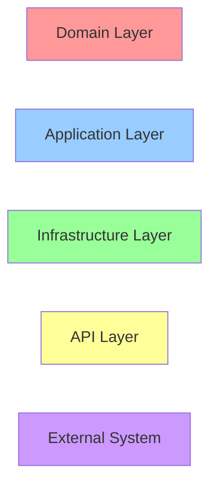

- 🔴 **Domain**: Business rules, entities, interfaces
- 🔵 **Application**: Use cases, orchestration, services
- 🟢 **Infrastructure**: Database, external adapters
- 🟡 **API**: HTTP routes, schemas, presentation
- 🟣 **External**: Third-party systems, databases

---

## 🧠 Maintaining Your Mental Model

**When reading code, ask**:
1. **Which layer am I in?** (Domain/Application/Infrastructure/API)
2. **What's this component's single responsibility?**
3. **What does it depend on?** (Always check imports - are they from outer layers?)
4. **What's the data flow?** (Request → Domain → Persistence → Response)

**When making changes**:
1. **Start in Domain**: Does this change business rules? Update entities/configs first
2. **Update Application**: Does orchestration logic change? Update managers/trainers
3. **Persist in Infrastructure**: Does data model change? Update ORM + migration
4. **Expose in API**: Should users access this? Add route + schema

**Remember**: Dependencies flow INWARD (API → Application → Domain), never outward!

---

*Last Updated: 2026-01-22*
*Generated for: QuiteReads Dashboard FYP Project*
