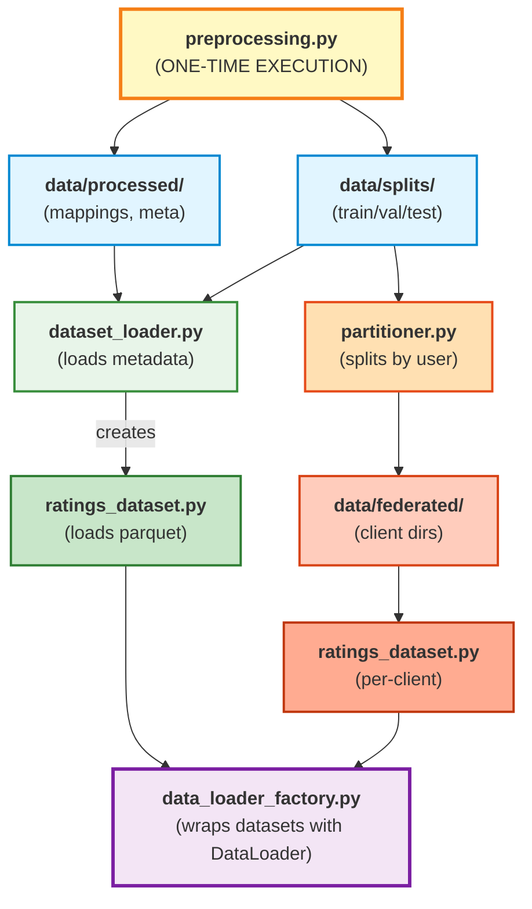
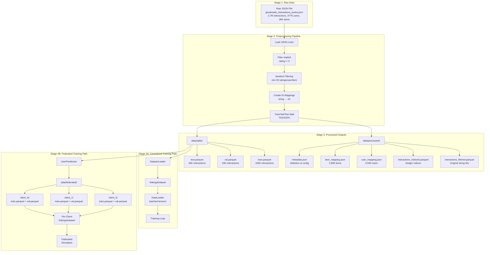
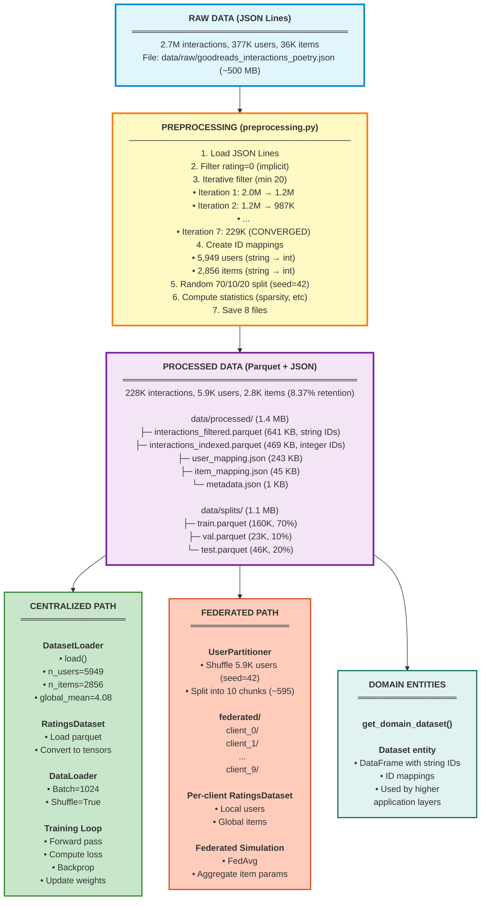

# Data Flow Pipeline

Complete guide to data flow from raw Goodreads JSON to PyTorch-ready tensors and federated client partitions.


---

## Table of Contents
- [Overview](#overview)
- [File Contributions Map](#file-contributions-map)
- [Complete Flow Diagram](#complete-flow-diagram)
- [Stage-by-Stage Breakdown](#stage-by-stage-breakdown)
  - [Stage 1: Raw Data Input](#stage-1-raw-data-input)
  - [Stage 2: Preprocessing Pipeline](#stage-2-preprocessing-pipeline)
  - [Stage 3: Processed Outputs](#stage-3-processed-outputs)
  - [Stage 4A: Centralized Training Path](#stage-4a-centralized-training-path)
  - [Stage 4B: Federated Training Path](#stage-4b-federated-training-path)
- [Data Flow Summary](#data-flow-summary)
- [Key Statistics](#key-statistics)

---

## Overview

The data pipeline transforms raw Goodreads JSON data into PyTorch-ready tensors for both centralized and federated book recommendation experiments. The pipeline consists of 4 main stages:

1. **Raw Data**: Goodreads Poetry Books interactions (2.7M interactions)
2. **Preprocessing**: Filter sparse entities, create ID mappings, split data
3. **Processed Outputs**: Clean parquet files with metadata and mappings
4. **Training Paths**: Either centralized (DatasetLoader) or federated (UserPartitioner)

---

## File Contributions Map

### Which File Does What?

| File | Stage | Responsibility | Reads From | Writes To |
|------|-------|----------------|------------|-----------|
| `preprocessing.py` | 2 | Transforms raw JSON into clean parquet splits | `data/raw/*.json` | `data/processed/*`, `data/splits/*` |
| `dataset_loader.py` | 4A | High-level manager that loads metadata and creates datasets | `data/processed/metadata.json`, `data/processed/*_mapping.json` | - (in-memory) |
| `ratings_dataset.py` | 4A/4B | PyTorch Dataset that loads parquet into tensors | `data/splits/*.parquet` or `data/federated/client_X/*.parquet` | - (in-memory) |
| `data_loader_factory.py` | 4A/4B | Creates PyTorch DataLoaders with batching/shuffling | - (receives RatingsDataset) | - (in-memory) |
| `partitioner.py` | 4B | Splits data by user for federated simulation | `data/splits/train.parquet`, `data/splits/val.parquet` | `data/federated/client_X/*` |
| `__init__.py` | - | Exports public API | - | - |

### File-to-File Data Flow Diagram

``` mermaid
flowchart TD
    Start["<b>RAW DATA (External)</b><br/>data/raw/goodreads_interactions_poetry.json<br/><i>JSON Lines format</i>"]
    
    Preprocess["<b>preprocessing.py</b><br/>──────────────────<br/><b>Functions:</b><br/>• load_raw_interactions()<br/>• filter_implicit_interactions()<br/>• iterative_filter()<br/>• create_id_mappings()<br/>• apply_id_mappings()<br/>• create_train_val_test_split()<br/>• compute_statistics()<br/>• save_artifacts()<br/><br/><b>Entry point:</b><br/>run_preprocessing_pipeline()"]
    
    ProcessedData["<b>Produces:</b><br/>data/processed/<br/>├─ interactions_filtered.parquet<br/>├─ interactions_indexed.parquet<br/>├─ user_mapping.json<br/>├─ item_mapping.json<br/>└─ metadata.json<br/><br/>data/splits/<br/>├─ train.parquet<br/>├─ val.parquet<br/>└─ test.parquet"]
    
    PathA["<b>PATH A:</b><br/>CENTRALIZED TRAINING"]
    PathB["<b>PATH B:</b><br/>FEDERATED TRAINING"]
    
    DatasetLoader["<b>dataset_loader.py</b><br/>──────────────────<br/><b>Class: DatasetLoader</b><br/>• load()<br/>  Reads: metadata.json,<br/>  user_mapping.json,<br/>  item_mapping.json<br/><br/><b>Properties:</b><br/>• n_users: 5949<br/>• n_items: 2856<br/>• global_mean: 4.08<br/><br/><b>Methods:</b><br/>• get_train_loader()<br/>• get_val_loader()<br/>• get_test_loader()"]
    
    Partitioner["<b>partitioner.py</b><br/>──────────────────<br/><b>Class: UserPartitioner</b><br/>• partition()<br/>  Reads: train.parquet, val.parquet<br/><br/>  Writes: data/federated/<br/>  ├─ partition_config.json<br/>  ├─ client_0/<br/>  │   ├─ train.parquet<br/>  │   └─ val.parquet<br/>  ├─ client_1/<br/>  └─ ...<br/><br/><b>Methods:</b><br/>• get_client_paths()<br/>• get_local_user_data()"]
    
    RatingsA["<b>ratings_dataset.py</b><br/>──────────────────<br/><b>Class: RatingsDataset</b><br/>• __init__(parquet_path)<br/>  Reads: splits/*.parquet<br/>• __getitem__(idx)<br/>  Returns: (user, item, rating)<br/><br/><b>Properties:</b><br/>• n_users<br/>• n_items<br/>• rating_mean<br/>• local_users"]
    
    RatingsB["<b>ratings_dataset.py</b><br/>──────────────────<br/><b>Class: RatingsDataset</b><br/>(Same class, different data)<br/><br/>Reads:<br/>federated/client_X/*.parquet<br/><br/>Each client gets own dataset<br/>with exclusive users"]
    
    FactoryA["<b>data_loader_factory.py</b><br/>──────────────────<br/><b>Functions:</b><br/>• create_train_loader()<br/>  - shuffle=True<br/>  - batch_size configurable<br/>• create_eval_loader()<br/>  - shuffle=False<br/>  - deterministic eval"]
    
    FactoryB["<b>data_loader_factory.py</b><br/>──────────────────<br/>(Same functions)<br/><br/>Per-client DataLoaders<br/>for local training"]
    
    TrainingLoop["<b>TRAINING LOOP</b><br/>(External: model training)<br/>──────────────────<br/>for users, items, ratings<br/>in train_loader:<br/>    predictions = model(...)<br/>    loss = criterion(...)<br/>    loss.backward()"]
    
    Federated["<b>FEDERATED SIMULATION</b><br/>(External: Flower framework)<br/>──────────────────<br/>Client trains locally<br/>Server aggregates updates"]
    
    Start --> Preprocess
    Preprocess --> ProcessedData
    ProcessedData --> PathA
    ProcessedData --> PathB
    
    PathA --> DatasetLoader
    PathB --> Partitioner
    
    DatasetLoader --> RatingsA
    Partitioner --> RatingsB
    
    RatingsA --> FactoryA
    RatingsB --> FactoryB
    
    FactoryA --> TrainingLoop
    FactoryB --> Federated
    
    style Start fill:#e1f5ff,stroke:#0288d1,stroke-width:2px
    style Preprocess fill:#fff9c4,stroke:#f57f17,stroke-width:2px
    style ProcessedData fill:#f3e5f5,stroke:#7b1fa2,stroke-width:2px
    style PathA fill:#c8e6c9,stroke:#2e7d32,stroke-width:3px
    style PathB fill:#ffccbc,stroke:#d84315,stroke-width:3px
    style DatasetLoader fill:#e8f5e9,stroke:#388e3c,stroke-width:2px
    style Partitioner fill:#ffe0b2,stroke:#e64a19,stroke-width:2px
    style RatingsA fill:#e8f5e9,stroke:#388e3c,stroke-width:2px
    style RatingsB fill:#ffe0b2,stroke:#e64a19,stroke-width:2px
    style FactoryA fill:#e8f5e9,stroke:#388e3c,stroke-width:2px
    style FactoryB fill:#ffe0b2,stroke:#e64a19,stroke-width:2px
    style TrainingLoop fill:#c8e6c9,stroke:#1b5e20,stroke-width:2px
    style Federated fill:#ffab91,stroke:#bf360c,stroke-width:2px
```


### File Interaction Summary



### What Happens After Preprocessing?

After running `preprocessing.py`, here's what each file does:

#### Centralized Training Flow
```
1. dataset_loader.py
   │
   ├── load() is called
   │   ├── Reads data/processed/metadata.json → gets n_users, n_items, global_mean
   │   ├── Reads data/processed/user_mapping.json → stores for potential reverse lookup
   │   └── Reads data/processed/item_mapping.json → stores for potential reverse lookup
   │
   ├── get_train_loader() is called
   │   ├── Internally creates RatingsDataset(data/splits/train.parquet)
   │   ├── Passes dataset to create_train_loader() from data_loader_factory.py
   │   └── Returns PyTorch DataLoader with shuffle=True
   │
   └── get_val_loader() / get_test_loader()
       ├── Creates RatingsDataset for val/test parquet
       └── Returns DataLoader with shuffle=False

2. ratings_dataset.py (called by dataset_loader.py)
   │
   └── __init__(parquet_path)
       ├── Reads parquet file with pandas
       ├── Extracts user_idx column → converts to LongTensor
       ├── Extracts item_idx column → converts to LongTensor
       ├── Extracts rating column → converts to FloatTensor
       └── Stores n_users, n_items, rating_mean as properties

3. data_loader_factory.py (called by dataset_loader.py)
   │
   └── create_train_loader(dataset, batch_size, num_workers)
       ├── Creates torch.utils.data.DataLoader
       ├── Sets shuffle=True for training
       └── Returns batched iterator over (users, items, ratings) tensors
```

#### Federated Training Flow
```
1. partitioner.py
   │
   ├── partition() is called
   │   ├── Reads data/splits/train.parquet → gets all training interactions
   │   ├── Reads data/splits/val.parquet → gets all validation interactions
   │   ├── Extracts unique users (5,949)
   │   ├── Shuffles users with seed for reproducibility
   │   ├── Splits into N chunks (e.g., 10 clients × ~595 users)
   │   │
   │   └── For each client_id in range(N):
   │       ├── Filters train data for client's users → saves to client_X/train.parquet
   │       ├── Filters val data for client's users → saves to client_X/val.parquet
   │       └── Records user assignments in partition_config.json
   │
   └── get_client_paths(client_id) → returns (train_path, val_path) for that client

2. ratings_dataset.py (called per client)
   │
   └── Each client creates own RatingsDataset
       └── Reads data/federated/client_X/train.parquet (only their users)

3. data_loader_factory.py (called per client)
   │
   └── Each client creates own DataLoader
       └── Local training happens on exclusive user data
```

---

## Complete Flow Diagram



---

## Stage-by-Stage Breakdown

### Stage 1: Raw Data Input

**Location**: `data/raw/goodreads_interactions_poetry.json`

**Format**: JSON Lines (one JSON object per line, not a JSON array)

**Example Content**:
```json
{"user_id": "8842281e1d1347389f2ab93d60773d4d", "book_id": "2767052", "rating": 5}
{"user_id": "8842281e1d1347389f2ab93d60773d4d", "book_id": "8564346", "rating": 4}
{"user_id": "a8d11d1b429e4f3091c17d7e1f4c8e5d", "book_id": "1234567", "rating": 0}
```

**Statistics (before filtering)**:
- **2,734,350 interactions** (user-book-rating tuples)
- **377,799 unique users**
- **36,514 unique books**
- **Ratings**: 0-5 scale
  - 0 = implicit (added to shelf, not rated)
  - 1-5 = explicit ratings

**File Size**: ~500 MB (gitignored due to size)

**How to Obtain**:
- Download from Goodreads dataset repository
- Place in `data/raw/` directory
- Not included in git due to size constraints

---

### Stage 2: Preprocessing Pipeline

**File**: [preprocessing.py](preprocessing.py)
**Function**: `run_preprocessing_pipeline()`
**Duration**: ~2-5 minutes (depends on machine)

#### Step 1: Load JSON Lines
**Function**: `load_raw_interactions()`
- Parses JSON Lines format (not standard JSON array)
- Extracts `user_id`, `book_id`, `rating` columns
- Validates data types (rating must be numeric)
- **Output**: DataFrame with 2.7M rows

#### Step 2: Filter Implicit Interactions
**Function**: `filter_implicit_interactions()`
- **Removes rating=0** (implicit "added to shelf", not actual rating)
- In Goodreads, rating=0 means user added book to shelf but didn't rate it
- Only explicit ratings (1-5) are valid for rating prediction
- **Output**: Reduced to ~2M explicit ratings

#### Step 3: Iterative Sparse Filtering
**Function**: `iterative_filter()`
- **Goal**: Remove users/items with < 20 ratings
- **Why iterative?** Removing sparse users makes some items sparse, vice versa
- **Process**:
  ```
  Iteration 1: Filter users → Filter items → 1,234,567 interactions left
  Iteration 2: Filter users → Filter items → 987,654 interactions left
  ...
  Iteration 7: Filter users → Filter items → 228,793 interactions (CONVERGED)
  ```
- **Convergence**: When no more entities fall below threshold
- **Justification**: 20-rating threshold matches Goodreads' policy for recommendations
- **Output**: 228,793 interactions, 5,949 users, 2,856 items (8.37% retention)

#### Step 4: Create ID Mappings
**Function**: `create_id_mappings()`
- **Problem**: PyTorch `nn.Embedding` requires contiguous integer indices [0, N-1]
- **Solution**: Map string IDs to integers
  ```python
  user_to_idx = {"8842281e...": 0, "a8d11d1b...": 1, ...}
  item_to_idx = {"2767052": 0, "8564346": 1, ...}
  ```
- **Bidirectional**: Also creates reverse mappings (idx → original ID)
- **Sorted**: Uses sorted unique IDs for reproducibility
- **Output**: 4 mapping dictionaries

#### Step 5: Train/Val/Test Split
**Function**: `create_train_val_test_split()`
- **Strategy**: Random split (not temporal, not user-based)
- **Ratios**:
  - Train: 70% (160,156 interactions)
  - Validation: 10% (22,879 interactions) - for early stopping
  - Test: 20% (45,758 interactions) - final evaluation only
- **Seeded**: seed=42 for reproducibility
- **Output**: 3 DataFrames with integer indices

#### Step 6: Compute Statistics
**Function**: `compute_statistics()`
- Calculates:
  - Sparsity: 1 - (observed / possible) = 98.65%
  - Density: 1.35%
  - Rating distribution: mean=4.08, std=0.97
  - Retention rate: 8.37%

#### Step 7: Save Artifacts
**Function**: `save_artifacts()`
- Saves all files to disk (see Stage 3)
- Creates comprehensive metadata.json

**Run Command**:
```bash
# Default preprocessing (20 min ratings, 70/10/20 split)
uv run python -m app.application.data.preprocessing \
    --raw-path data/raw/goodreads_interactions_poetry.json \
    --output-dir data

# Custom thresholds
uv run python -m app.application.data.preprocessing \
    --min-user-ratings 15 \
    --min-item-ratings 15 \
    --val-ratio 0.15 \
    --test-ratio 0.15 \
    --seed 123
```

**Programmatic Usage**:
```python
from pathlib import Path
from app.application.data import PreprocessingConfig, run_preprocessing_pipeline

config = PreprocessingConfig(
    min_user_ratings=20,
    min_item_ratings=20,
    val_ratio=0.1,
    test_ratio=0.2,
    random_seed=42
)

metadata = run_preprocessing_pipeline(
    raw_path=Path('data/raw/goodreads_interactions_poetry.json'),
    output_dir=Path('data'),
    config=config
)

print(f"Filtered users: {metadata['statistics']['filtered_users']:,}")
print(f"Sparsity: {metadata['statistics']['sparsity_percent']}")
```

---

### Stage 3: Processed Outputs

**Directory Structure**:
```
data/
├── raw/
│   └── goodreads_interactions_poetry.json  (2.7M interactions, gitignored)
│
├── processed/
│   ├── interactions_filtered.parquet       (641 KB, original string IDs)
│   ├── interactions_indexed.parquet        (469 KB, integer indices for PyTorch)
│   ├── user_mapping.json                   (243 KB, 5,949 mappings)
│   ├── item_mapping.json                   (45 KB, 2,856 mappings)
│   └── metadata.json                       (1 KB, stats & config)
│
└── splits/
    ├── train.parquet                       (160,156 interactions)
    ├── val.parquet                         (22,879 interactions)
    └── test.parquet                        (45,758 interactions)
```

#### File Details Table

| File | Size | Rows | Columns | Purpose |
|------|------|------|---------|---------|
| `interactions_filtered.parquet` | 641 KB | 228,793 | user_id, book_id, rating | Filtered data with original string IDs (for reference) |
| `interactions_indexed.parquet` | 469 KB | 228,793 | user_idx, item_idx, rating | Same data with integer indices (PyTorch-ready) |
| `user_mapping.json` | 243 KB | 5,949 | user_id → user_idx | String to int mapping for users |
| `item_mapping.json` | 45 KB | 2,856 | book_id → item_idx | String to int mapping for books |
| `metadata.json` | 1 KB | - | - | Config, statistics, file paths |
| `train.parquet` | - | 160,156 | user_idx, item_idx, rating | Training split (70%) |
| `val.parquet` | - | 22,879 | user_idx, item_idx, rating | Validation split (10%) |
| `test.parquet` | - | 45,758 | user_idx, item_idx, rating | Test split (20%) |

#### Metadata Contents

**File**: `data/processed/metadata.json`

```json
{
  "preprocessing_date": "2025-12-24T18:46:07.403866",
  "config": {
    "min_user_ratings": 20,
    "min_item_ratings": 20,
    "val_ratio": 0.1,
    "test_ratio": 0.2,
    "random_seed": 42
  },
  "filter_iterations": 7,
  "statistics": {
    "original_interactions": 2734350,
    "original_users": 377799,
    "original_items": 36514,
    "filtered_interactions": 228793,
    "filtered_users": 5949,
    "filtered_items": 2856,
    "sparsity": 0.986534,
    "sparsity_percent": "98.65%",
    "density_percent": "1.3466%",
    "rating_mean": 4.0751,
    "rating_std": 0.9718,
    "rating_min": 1,
    "rating_max": 5,
    "retention_rate": "8.37%"
  },
  "train_size": 160156,
  "val_size": 22879,
  "test_size": 45758,
  "files": {
    "interactions_filtered": "processed/interactions_filtered.parquet",
    "interactions_indexed": "processed/interactions_indexed.parquet",
    "user_mapping": "processed/user_mapping.json",
    "item_mapping": "processed/item_mapping.json",
    "train": "splits/train.parquet",
    "val": "splits/val.parquet",
    "test": "splits/test.parquet"
  }
}
```

#### User Mapping Example

**File**: `data/processed/user_mapping.json`

```json
{
  "0008fba0a9804f94a63c356ea63dcde9": 0,
  "001a1ad6f03f48f89e5ca17cb8447e62": 1,
  "002c2e3db9fc44d89dcda10c1cd9f3c8": 2,
  ...
  "fffb9a1e2c3d4e5f6789abcdef012345": 5948
}
```

#### Item Mapping Example

**File**: `data/processed/item_mapping.json`

```json
{
  "1": 0,
  "2": 1,
  "3": 2,
  ...
  "9999999": 2855
}
```

---

### Stage 4A: Centralized Training Path

**Files Involved**:
- [dataset_loader.py](dataset_loader.py)
- [ratings_dataset.py](ratings_dataset.py)
- [data_loader_factory.py](data_loader_factory.py)

#### Flow Diagram

```
data/splits/train.parquet
         ↓
   DatasetLoader.load()
         ↓
   RatingsDataset (PyTorch Dataset)
         ↓
   create_train_loader() (Factory)
         ↓
   DataLoader (batched tensors)
         ↓
   Training Loop (model.forward())
```

#### Step 1: Initialize DatasetLoader

**File**: [dataset_loader.py](dataset_loader.py)
**Class**: `DatasetLoader`

```python
from app.application.data import DatasetLoader
from pathlib import Path

# Initialize
loader = DatasetLoader(data_dir=Path('data'))

# Load metadata and mappings
loader.load()  # MUST call this first

# Access properties
print(f"Users: {loader.n_users}")      # 5949
print(f"Items: {loader.n_items}")      # 2856
print(f"Global mean: {loader.global_mean:.2f}")  # 4.08
```

**What `load()` does**:
- Reads `metadata.json` → stores statistics
- Reads `user_mapping.json` → stores 5,949 mappings
- Reads `item_mapping.json` → stores 2,856 mappings
- Validates all required files exist

#### Step 2: Create RatingsDataset

**File**: [ratings_dataset.py](ratings_dataset.py)
**Class**: `RatingsDataset`

```python
# Internally called by DatasetLoader
train_dataset = loader.get_train_dataset()

# Or create directly
from app.application.data import RatingsDataset
train_dataset = RatingsDataset(
    parquet_path='data/splits/train.parquet',
    n_users=5949,
    n_items=2856
)

# Dataset properties
print(f"Size: {len(train_dataset)}")  # 160,156
print(f"Rating mean: {train_dataset.rating_mean:.2f}")  # 4.08
print(f"Local users: {train_dataset.num_local_users}")  # 5949

# Get single interaction
user_idx, item_idx, rating = train_dataset[0]
# Returns: (tensor([123]), tensor([456]), tensor([5.0]))
```

**What happens inside**:
- Loads `train.parquet` with pandas
- Converts columns to PyTorch tensors:
  - `users`: LongTensor of shape (160156,)
  - `items`: LongTensor of shape (160156,)
  - `ratings`: FloatTensor of shape (160156,)

#### Step 3: Create DataLoader

**File**: [data_loader_factory.py](data_loader_factory.py)
**Functions**: `create_train_loader()`, `create_eval_loader()`

```python
from app.application.data import create_train_loader, create_eval_loader

# Training DataLoader (with shuffling)
train_loader = create_train_loader(
    dataset=train_dataset,
    batch_size=1024,
    num_workers=4,
    pin_memory=True  # Faster GPU transfer
)

# Validation DataLoader (no shuffling)
val_loader = create_eval_loader(
    dataset=val_dataset,
    batch_size=2048,  # Can use larger batch since no gradients
    num_workers=4,
    pin_memory=True
)
```

**Key Differences**:
| Property | Train Loader | Val/Test Loader |
|----------|--------------|-----------------|
| `shuffle` | `True` | `False` |
| Purpose | Stochastic gradient descent | Deterministic evaluation |
| Batch size | 1024 (typical) | 2048 (can be larger) |

#### Step 4: Training Loop

```python
from src.models.matrix_factorization import BiasedMatrixFactorization
import torch.nn as nn
import torch.optim as optim

# Initialize model with unpacked args
model = BiasedMatrixFactorization(
    **loader.get_model_init_args(),  # n_users, n_items, global_mean
    n_factors=50,
    learning_rate=0.01
)

criterion = nn.MSELoss()
optimizer = optim.Adam(model.parameters(), lr=0.01)

# Training loop
for epoch in range(10):
    model.train()
    epoch_loss = 0.0

    for batch_idx, (users, items, ratings) in enumerate(train_loader):
        # users, items, ratings are tensors of shape (batch_size,)

        optimizer.zero_grad()
        predictions = model(users, items)
        loss = criterion(predictions, ratings)
        loss.backward()
        optimizer.step()

        epoch_loss += loss.item()

    print(f"Epoch {epoch+1}: Loss = {epoch_loss / len(train_loader):.4f}")
```

---

### Stage 4B: Federated Training Path

**File Involved**: [partitioner.py](partitioner.py)

#### Flow Diagram

```
data/splits/train.parquet + val.parquet
         ↓
   UserPartitioner.partition()
         ↓
   Shuffle users & split into N chunks
         ↓
   data/federated/client_X/train.parquet + val.parquet
         ↓
   Per-client RatingsDataset
         ↓
   Federated Simulation (Flower framework)
```

#### Step 1: Partition Data

**File**: [partitioner.py](partitioner.py)
**Class**: `UserPartitioner`

```python
from app.application.data import UserPartitioner, PartitionConfig
from pathlib import Path

# Configure partitioning
config = PartitionConfig(
    num_clients=10,  # 10 federated clients
    seed=42          # Reproducibility
)

# Create partitioner
partitioner = UserPartitioner(config)

# Partition data
result = partitioner.partition(
    data_dir=Path('data'),           # Reads from data/splits/
    output_dir=Path('data/federated') # Writes to data/federated/
)

# Inspect results
print(f"Created {result.num_clients} clients")
print(f"Users per client: {result.users_per_client}")
# Output: [595, 595, 595, 595, 595, 595, 595, 594, 594, 594]

print(f"Interactions per client: {result.interactions_per_client}")
# Output: {0: (16015, 2287), 1: (16016, 2288), ...}

print(f"Global mean: {result.global_mean:.2f}")  # 4.08
```

**What `partition()` does**:
1. Loads `train.parquet` and `val.parquet`
2. Gets unique users: 5,949
3. Shuffles users with seed=42
4. Splits into 10 chunks: ~595 users per client
5. For each client:
   - Filters train/val data for client's users
   - Saves to `client_X/train.parquet` and `client_X/val.parquet`
6. Saves partition config with user→client mapping

#### Step 2: Directory Structure After Partitioning

```
data/federated/
├── partition_config.json              (Metadata, 45 KB)
├── client_0/
│   ├── train.parquet                  (16,015 interactions, ~50 KB)
│   └── val.parquet                    (2,287 interactions, ~8 KB)
├── client_1/
│   ├── train.parquet                  (16,016 interactions)
│   └── val.parquet                    (2,288 interactions)
├── client_2/
│   ├── train.parquet
│   └── val.parquet
...
└── client_9/
    ├── train.parquet                  (15,987 interactions)
    └── val.parquet                    (2,284 interactions)
```

**Total Size**: ~1.5 MB (same data, just partitioned)

#### Step 3: Partition Config

**File**: `data/federated/partition_config.json`

```json
{
  "num_clients": 10,
  "seed": 42,
  "total_users": 5949,
  "total_items": 2856,
  "global_mean": 4.0751,
  "total_train_interactions": 160156,
  "total_val_interactions": 22879,
  "users_per_client": [595, 595, 595, 595, 595, 595, 595, 594, 594, 594],
  "interactions_per_client": {
    "0": {"train": 16015, "val": 2287},
    "1": {"train": 16016, "val": 2288},
    "2": {"train": 16015, "val": 2287},
    ...
    "9": {"train": 15987, "val": 2284}
  },
  "user_to_client": {
    "0": 3,
    "1": 7,
    "2": 1,
    ...
    "5948": 9
  }
}
```

**Key Properties**:
- **Disjoint**: Each user belongs to exactly one client
- **IID**: Users randomly shuffled (independent and identically distributed)
- **Complete**: All 5,949 users assigned across 10 clients
- **Global items**: All clients share the same 2,856 item catalog

#### Step 4: Access Client Data

```python
# Get paths to client's data
train_path, val_path = partitioner.get_client_paths(client_id=0)
print(train_path)  # data/federated/client_0/train.parquet
print(val_path)    # data/federated/client_0/val.parquet

# Get domain entity for client
local_data = partitioner.get_local_user_data(client_id=0)
print(f"Client 0 has {len(local_data.user_ids)} users")  # 595
print(f"Client 0 has {len(local_data.ratings_df)} interactions")  # 18302

# Verify partitions are valid (disjoint & complete)
from app.application.data import verify_partitions
is_valid = verify_partitions(Path('data/federated'))
print(f"Partitions valid: {is_valid}")  # True
```

#### Step 5: Per-Client Training

```python
from app.application.data import RatingsDataset, create_train_loader

# Load client 0's data
client_train = RatingsDataset(
    parquet_path='data/federated/client_0/train.parquet',
    n_users=5949,   # Global user count (for consistent embedding size)
    n_items=2856    # Global item count
)

# Create DataLoader
client_loader = create_train_loader(client_train, batch_size=512)

# Train local model (Flower client)
for users, items, ratings in client_loader:
    # Local training on client's exclusive users
    predictions = local_model(users, items)
    loss = criterion(predictions, ratings)
    loss.backward()
```

**Federated Learning Key Points**:
- Each client trains on **exclusive set of users** (privacy-preserving)
- All clients share **global item embeddings** (books are public)
- FedAvg strategy aggregates **only item parameters** (user embeddings stay local)

---

## Data Flow Summary

### Summary Table

| Stage | Input | Process | Output | File Size | Duration |
|-------|-------|---------|--------|-----------|----------|
| **1. Raw** | Download dataset | - | `raw/goodreads_interactions_poetry.json` | ~500 MB | - |
| **2. Preprocess** | Raw JSON | Filter, map, split | `processed/` (5 files) + `splits/` (3 files) | ~1.5 MB | 2-5 min |
| **3A. Centralized** | Splits | Load with DatasetLoader | PyTorch DataLoaders | In-memory | <1 sec |
| **3B. Federated** | Splits | Partition by user | `federated/client_X/` (N × 2 files) | ~1.5 MB | <1 min |
| **4. Training** | DataLoaders | Train model | Trained model weights | Variable | Hours |

### Visual: Complete Pipeline



---

## Key Statistics Across Pipeline

### Transformation Statistics

| Metric | Raw | After Filtering | Train Split | Fed Client (avg) |
|--------|-----|-----------------|-------------|------------------|
| **Interactions** | 2,734,350 | 228,793 (8.37%) | 160,156 (70%) | 16,016 (10%) |
| **Users** | 377,799 | 5,949 (1.57%) | 5,949 | 595 (10%) |
| **Items** | 36,514 | 2,856 (7.82%) | 2,856 | 2,856 (global) |
| **Sparsity** | ~99.8% | 98.65% | 98.65% | ~99.1% |
| **Density** | ~0.2% | 1.35% | 1.35% | ~0.9% |
| **Rating Mean** | N/A | 4.08 | 4.08 | 4.08 |
| **Files** | 1 JSON | 8 files | 3 parquet | 2 parquet/client |
| **Total Size** | ~500 MB | ~1.5 MB | ~1.1 MB | ~58 KB/client |

### Sparsity Visualization

```
Original Dataset (99.8% sparse):
■□□□□□□□□□ ... (377K users × 36K items = 13.6 billion cells)

Filtered Dataset (98.65% sparse):
■■□□□□□□□□ ... (5.9K users × 2.8K items = 17 million cells)

Observed: 228K interactions / 17M possible = 1.35% density
```

### Rating Distribution

```
Rating Distribution (after filtering):
5 ⭐: ████████████████████████ 48.2% (110K)
4 ⭐: ████████████████████     38.5% (88K)
3 ⭐: ██████                   11.8% (27K)
2 ⭐: ██                        1.3% (3K)
1 ⭐: █                         0.2% (0.5K)

Mean: 4.08 ± 0.97
```

### Data Reduction Summary

```
Stage               Interactions    Users      Items      Files    Size
──────────────────────────────────────────────────────────────────────────
Raw JSON            2,734,350       377,799    36,514     1        ~500 MB
After filter        228,793 (8%)    5,949 (2%) 2,856 (8%) 8        1.5 MB
Train split         160,156 (70%)   5,949      2,856      3        1.1 MB
Fed client (avg)    16,016 (10%)    595 (10%)  2,856      2        58 KB
──────────────────────────────────────────────────────────────────────────
Compression ratio: 500 MB → 1.5 MB (333×)
```

---

## Quick Start Commands

### 1. Preprocess Raw Data
```bash
# Download raw data first (not in git)
# Place in data/raw/goodreads_interactions_poetry.json

# Run preprocessing
uv run python -m app.application.data.preprocessing \
    --raw-path data/raw/goodreads_interactions_poetry.json \
    --output-dir data
```

### 2. Load for Centralized Training
```python
from app.application.data import DatasetLoader

loader = DatasetLoader(data_dir='data')
loader.load()

train_loader = loader.get_train_loader(batch_size=1024)
val_loader = loader.get_val_loader(batch_size=2048)
```

### 3. Partition for Federated Learning
```python
from app.application.data import UserPartitioner, PartitionConfig

partitioner = UserPartitioner(PartitionConfig(num_clients=10))
result = partitioner.partition(
    data_dir='data',
    output_dir='data/federated'
)
```

---

## Related Documentation

- [Main Module README](README.md) - Full technical documentation
- [preprocessing.py](preprocessing.py) - Preprocessing implementation
- [dataset_loader.py](dataset_loader.py) - DatasetLoader implementation
- [partitioner.py](partitioner.py) - UserPartitioner implementation
